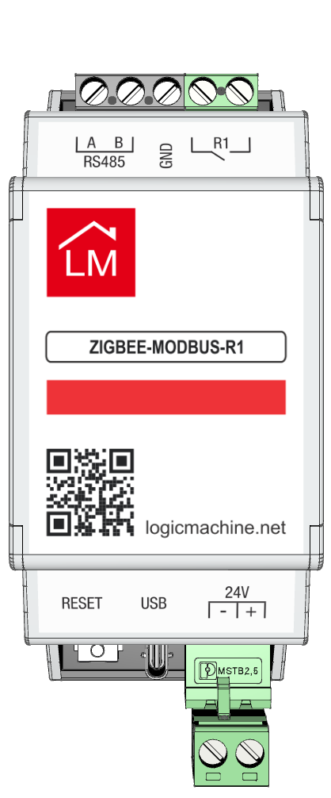
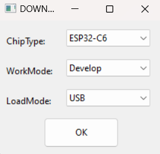
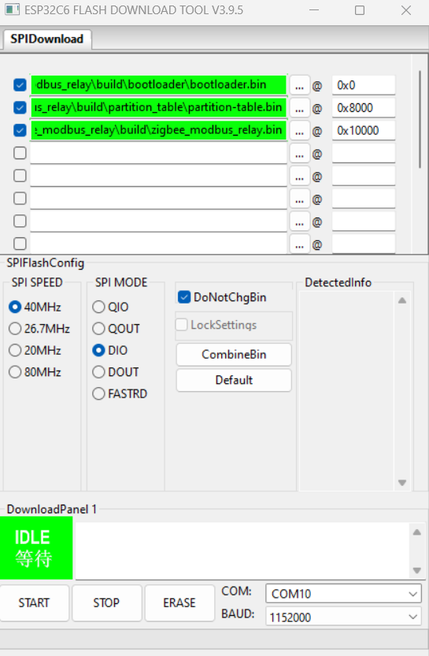

# ZigBee-Modbus-Relay

Wired is inconvenient, wireless is unreliable. What if you could combine the best of both worlds?

We present **ZigBee-Modbus-R1** a unique device designed to solve this very problem.
It's a hybrid relay that simultaneously supports both the wired Modbus RTU interface
and the wireless ZigBee network. This allows you to create truly flexible and
fault-tolerant control systems.

  

**Key Features:**

**Flexible Installation:** Use the ZigBee wireless protocol where running cables is impossible or not cost-effective.

**Industrial Reliability:** Rely on the time-tested Modbus wired protocol for mission-critical parts of your system where stability is paramount.

**Maximum Fault Tolerance (Failover):** Activate both interfaces simultaneously. In case of a failure on one network
(e.g., a cable break or strong radio interference), the device remains controllable via the second network, ensuring uninterrupted operation.

A unique approach to simultaneous ZigBee and Modbus protocol support,
providing control from multiple networks and status conversion between protocols. 

## Youtube video

## Device usage

Device will attempt to connect to the ZigBee network after turning on
(24VDC power should be connected). Short press on reset button resets
device. Long press on reset button (about 4 seconds) until the LED starts
flashing performs a complete reset of ZigBee settings. Modbus ID, baudrate
and parity can only be set via ZigBee parameters, so it's mandatory to
connect it to a ZigBee network first.

## Project built

Project is built using:  
**esp-idf-v5.3.2** (for Linux)  

Export path:  
**cd esp-idf**  
**. ./export.sh**

Go to directory:  
**cd zigbee\zigbee_modbus\zigbee_modbus_relay**  

Commads:  
**idf.py set-target esp32c6**  
**idf.py build**  

Binary files and addresses:  
**bootloader.bin 0x0**  
**partition-table.bin 0x8000**  
**zigbee_modbu_relay.bin 0x10000**

## Firmware flashing
 
ESP32 device flashing:  

Download [Flash Download Tools](https://www.espressif.com/en/support/download/other-tools)  
Connect device to PC via USB while holding the programming button  
Run **flash_download_tool.exe** and select the following values  

* ChipType = ESP32-C6
* WorkMode = Develop
* LoadMode = USB

  
  

* Tick the checkboxes
* Choose binary files and set the addresses
* Select correct COM port as detected by the OS
* Click **ERASE** button, to erase ESP32-C6 memory
* Click **START** button, to upload the firmware

 

**WARNING**

**Intermittent ZigBee Initialization Failure on Cold Boot**

There is a known, hard-to-reproduce issue where the ZigBee stack may fail to initialize on a cold boot (i.e., when power is first connected). This occurs intermittently, approximately once in every 50 power cycles.

**Workaround:** A simple power cycle (unplugging and replugging the device) or a manual reset resolves the issue.

## PCB Design

We can provide the PCB design files to those who are interested.
Please reach out and let us know. Your feedback is important, as
it helps us understand our community and who we're collaborating with.

https://logicmachine.net/contact-us

